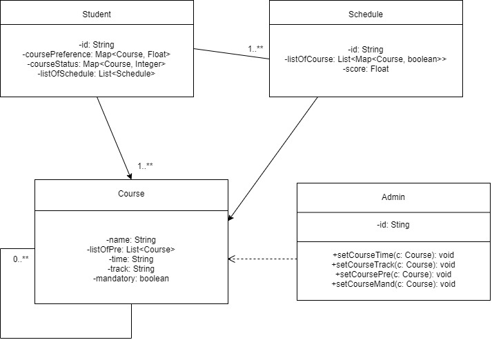
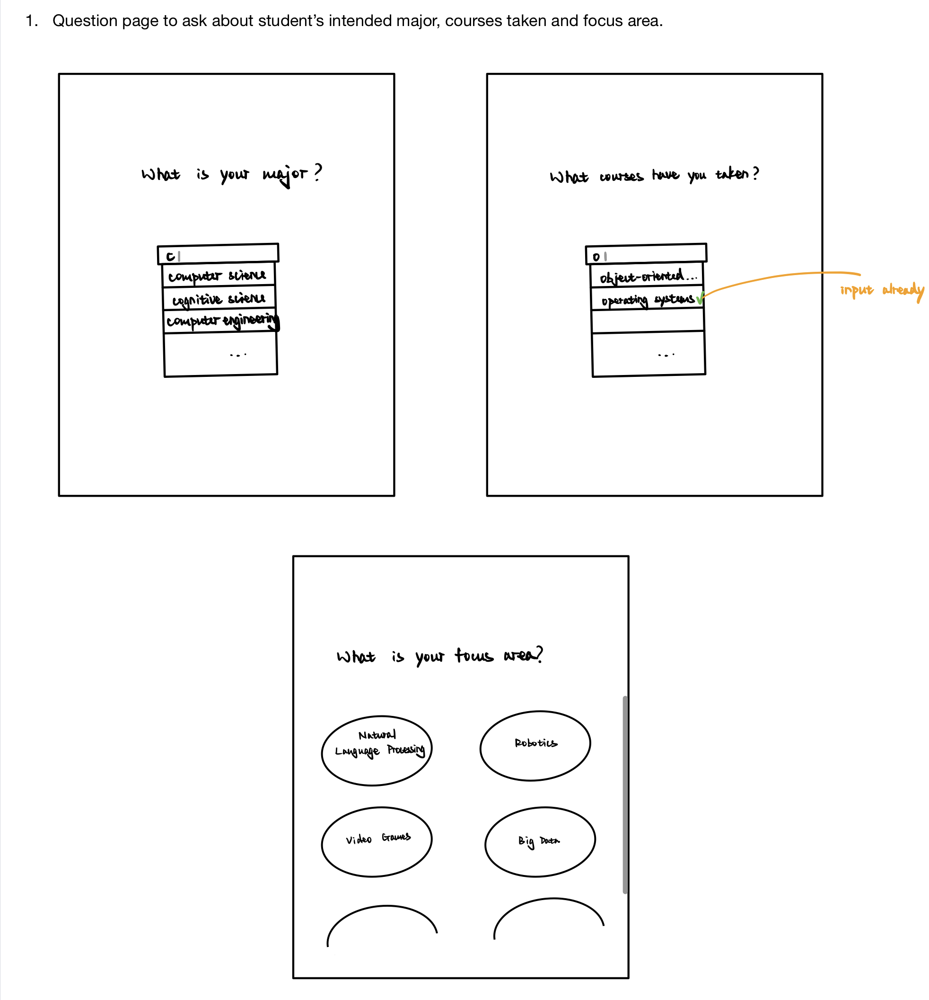
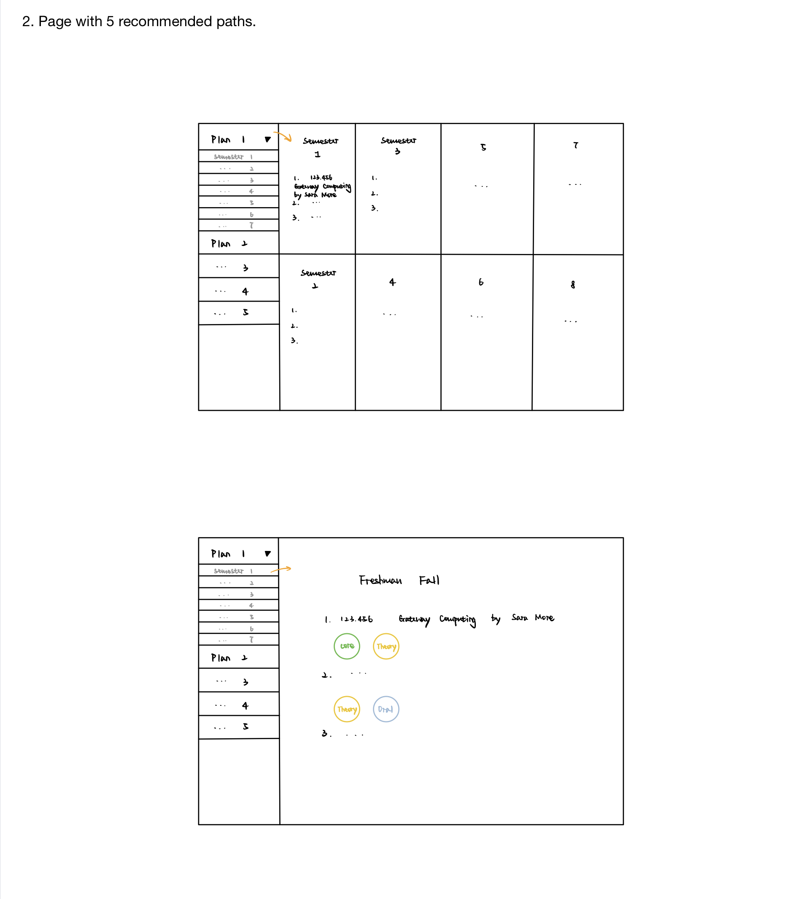

# OO Design

A UML class diagram reflecting the "model" for that iteration only.
Use a software to draw this (e.g. draw.io) and save the diagram as an image.
Upload the image and link it in here using this sintax.

# Wireframe

# Iteration Backlog

- As a student, I want to input my major and courses taken so that the application knows my current progress.
- As a student, I want to see a list of courses that I'm eligible for in the next semester so that I can choose between them.
- As a student, I want to determine the number of courses I want to take each semester so that I can evenly distribute remaining courses to each semester.
- As a student, I want to receive a schedule that follows my interest, so that I can directly use it as my plan.

# Tasks

- Establish a sqlite database.
- Build a basic frontend with React.
- Build a server with Node.js; set up needed APIs.
- Store courses in database.

# Retrospective

In terms of development on the front end, familiarizing ourselves with Javascript and React was the major challenge encountered. The quick tutorial on the 
React official website helped us a lot by walking us through a tic-tac-toe game implementation, illustrating the pros and cons of different designs and 
providing a general overview what React developers should epxect. Since the output for this iteration is relatively simple, we were able to deliver all that was needed. Upon acquiring inputs from the user, our implementation fetches data from the backend and redirects user to different pages based the specific 
input values. For subsequent iterations, we will build upon the current framework by allowing more inputs from the user, constructing a calendar view 
for the course recommendations, and most importantly posting data to the backend to accomodate a variety of user inputs. 

As for the database section, we go through the sqlite3 and node.js tutorial so that we can connect them and manipulate sqlite3 database inside a node server. For the first iteration, we successfully hardcode three recommended track courses and eleven core courses for each track into our sqlite3 database and allow the node server to extract the information out of it. Since it is relatively simple, the process is quite smooth. For the second iteration, we plan to build models for each class in our application and use the persistence layer and ORM to facilitate the process of storing our java object information into the database table. Also, each model will be designed according to our OO Design as shown above.
