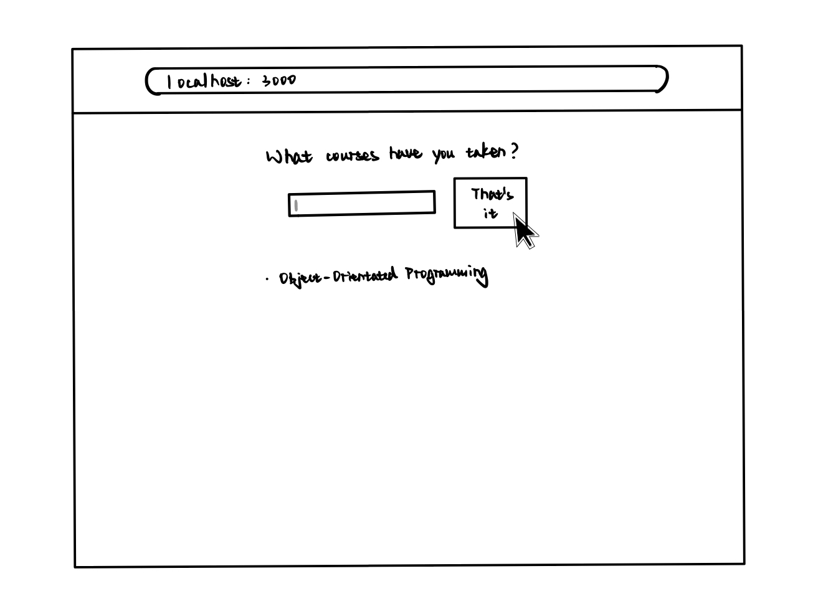
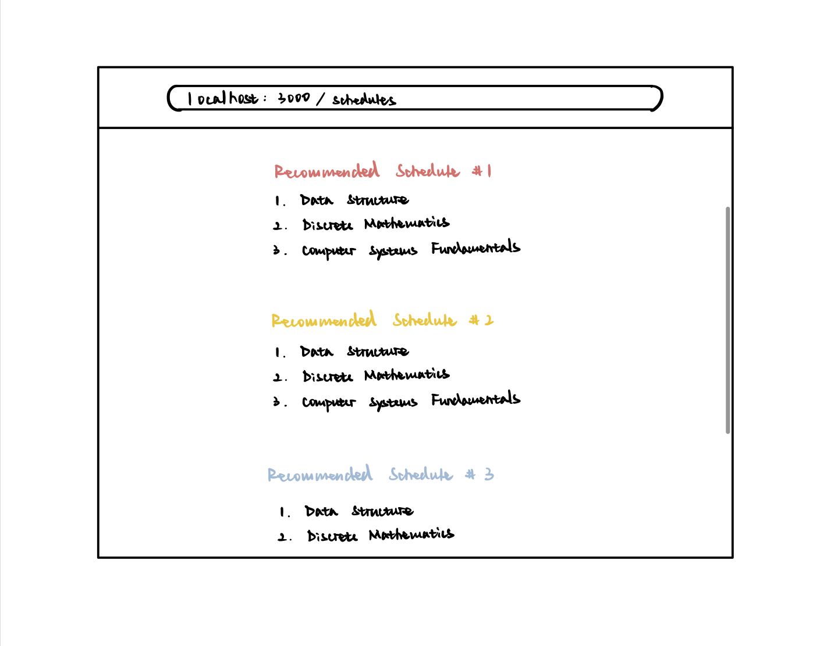

# OO Design

A UML class diagram reflecting the "model" for that iteration only.
Use a software to draw this (e.g. draw.io) and save the diagram as an image.
Upload the image and link it in here using this sintax.

# Wireframe

On the first page, the user is asked to input the courses he/she has taken. 

Once all courses are added, the user clicks on "That's it", which would then redirect him/her to the following page. 

The user clicks on one of the focus areans and is then taken to the final recommendation page.   

## Iteration Backlog
- As a student, I want to input the courses I have taken so that the application knows my current progress.
- As a student, I want to see multiple recommended schedules so that I get the flexibility to choose between them. 
- As a student, I want to receive a schedule that doesn’t contain time conflicts, so that I can directly use it as my plan.

## Tasks
- Implement a simple version of course recommendation algorithm that outputs recommendations for next semester.
- Add interfaces that allow users to input the courses he/she has taken.
- Add all course infomation to database.

# Retrospective

As for the iteration part of the database section, we adding a new feature: prerequisite to each course so that now the recommendation courses to the user will be those courses that all of its prerequisite courses have been taken. The process is quite smooth. However, there exists some difficulties when we send all the courses back to the frontend. It turned out to be the request from the frontend is lack with some important information in the header s.t. the req.body is empty. Thanks to the effort of our groupmate, the difficulty has been resolved. In this iteration we also completed the algorithm to recommend one semester of courses for our user. For the next iteration, we will recommend a whole path to the user, so that some effort and update will be made in the database section so that we can fulfill this new feature.

