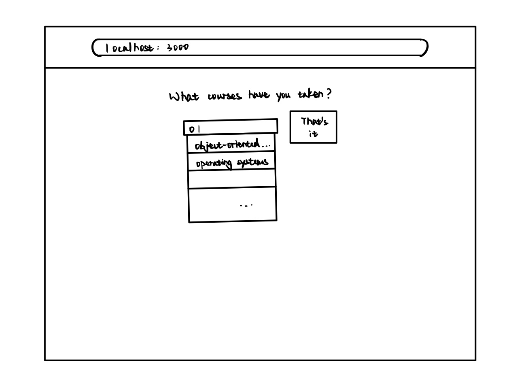
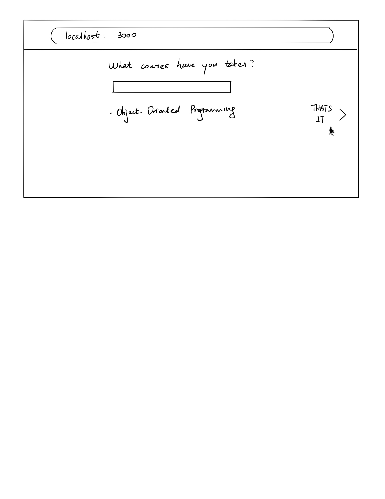
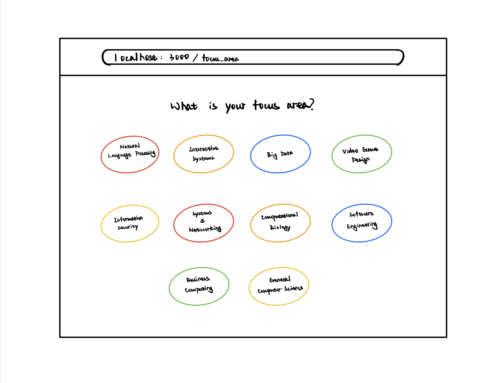
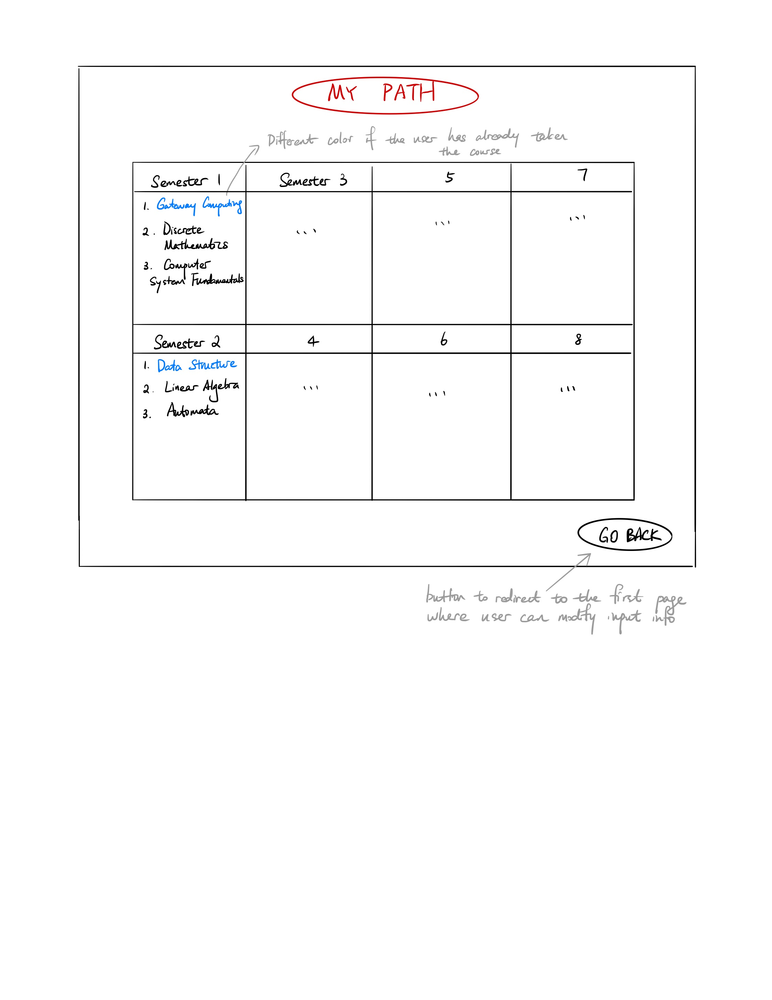

# OO Design

A UML class diagram reflecting the "model" for that iteration only.
Use a software to draw this (e.g. draw.io) and save the diagram as an image.
Upload the image and link it in here using this sintax.

# Wireframe
The first and second page will remain the same as Iteration 2, where the user is first asked to input the courses he/she has taken.

Once all courses are added, the user clicks on "That's it", which would then redirect him/her to the following page.

The user clicks on one of the focus areas and is then taken to the final recommendation page. The recommendation page shows a complete 4-year schedule with specific courses to take each semester.

## Iteration Backlog
- As a student, I want to get recommendations on a full path (as opposed to a single semester) based on the courses I have taken before.
- As a student, I want to make sure the prerequisite requirements are satisfied when I take the recommended courses.
- As a student, I want to receive a schedule that doesn’t contain time conflicts, so that I can directly use it as my plan.
- As a student, I want to see my recommended path in a calendar view.

## Tasks
- Re-organize the docs directory.
- Implement a simple but full version of course recommendation algorithm(exclude recommendation based on preferences).
- Add a better interface for displaying course schedules.
- Add all course infomation to database.

# Retrospective
There were some logic flaws in our it3 design. One glaring mistake was the fact that we could not possibly display the full 8-semester calendar view without information on when the previous courses were taken. We ended up adding an additioinal page for the user to provide his/her current semester x. So our computation can just focus on computing courses for the (8 - x) semesters ahead. 
The different color scheme to distinguish courses taken or not (shown in the above wireframe) was also abandoned in our actual implementation. We re-considered the objective of this web application, and it seems that displaying previous courses is of minimal interest. In the next iteration, we will come up with new designs on the final recommendation page to help our user focus only on what is ahead. 
