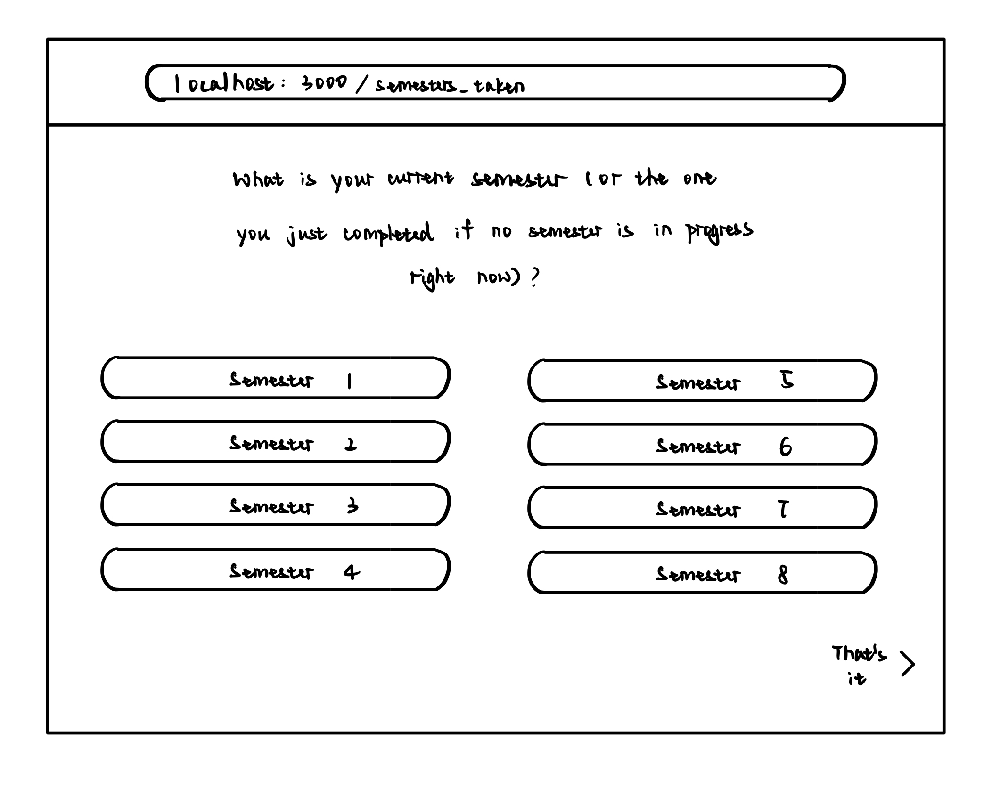
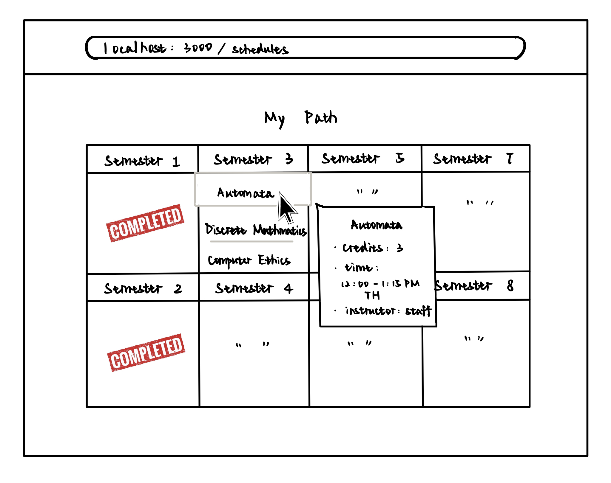
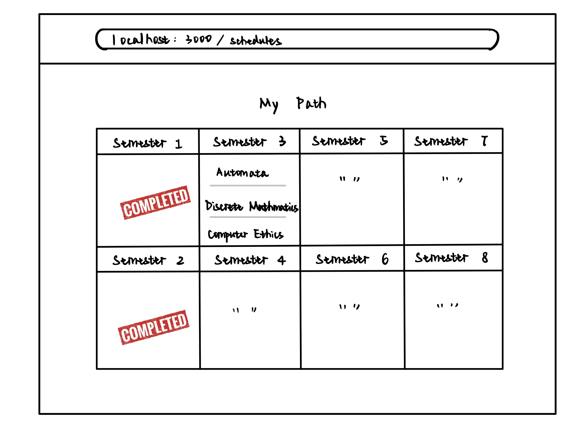
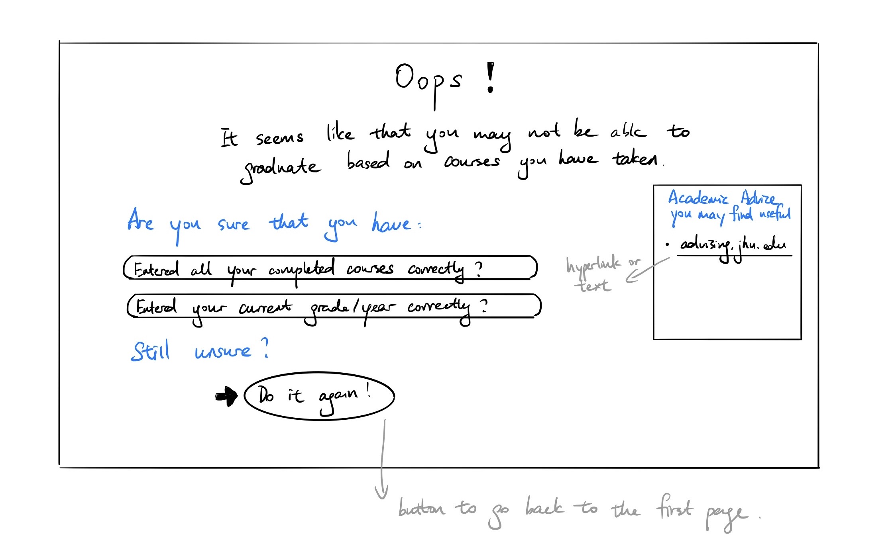

# OO Design

# Wireframe
The first and second page will remain the same as Iteration 2, where the user is first asked to input the courses he/she has taken.

Once all courses are added, the user clicks on "That's it", which would then redirect him/her to the following pages.

The user clicks on one of the focus areas and is then taken to the final recommendation page. The recommendation page shows a complete 4-year schedule with specific courses to take each semester.

User is given more details on a course once his/her cursor hovers on that course. In the event that there does NOT exist a schedule to allow the user to graduate in 4 years, the user is taken to the following page.

## Iteration Backlog
- As a student , I want to make sure that I can successfully graduate by following the recommended course path.
- As a student, I want to know if I can graduate on time with a CS degree based on my current school year and the courses I have taken.
- As a student, I want to receive a schedule that fits into the school’s spring/fall course offerings, so that the schedule is correct and practical.
- As a student who has taken 1+ gap semesters, I want to receive a schedule that accomodates to my unique circumstances.
    (e.g. after a gap semester, I might start my sophomore year in the spring)
- As a student, I want to see an 8-semester overview of my academic progress(e.g. what has been completed, what is yet to be done) in the final recommended course path calendar view.

## Tasks
- Optimize code to eliminate redundencies.

## Retrospective
For this iteration, we have accomplished implementation of checking graduation requirement in order to deliver a final path that would ensure students to be able to graduate based on the JHU CS undergrad requirements. If according to current progress, the student wouldn't be able to graduate on time, the application would recognize that and direct him/her to a new page. We also collected more input from our users ---- the semester he/she would like to start taking classes in case he/she plans on taking gap semesters. For the code implementation, we minimized redundencies in rewriting similar code by combining different components in the client/src directory into a single component. Due to the nature of our application, we realized that our code so far is more procedural than object-oriented, which we plan to adjust in the next iteration. We also aim to deliver multiple paths that can fit the graduation requirement for the users to enhance their user-experience.
