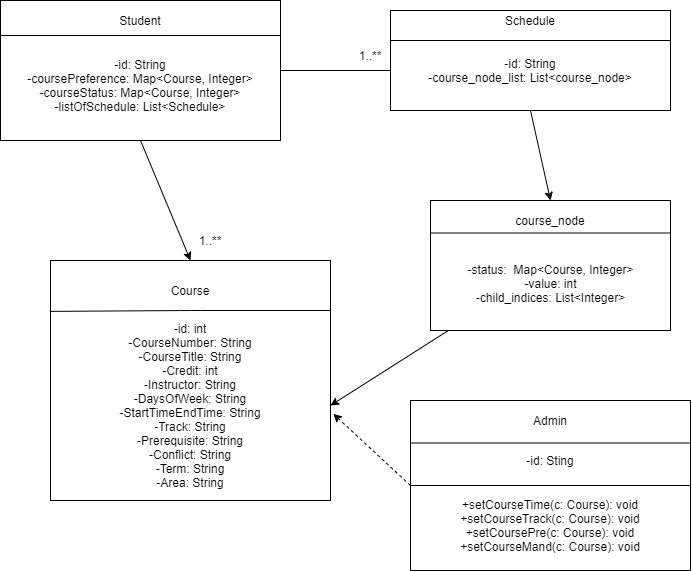
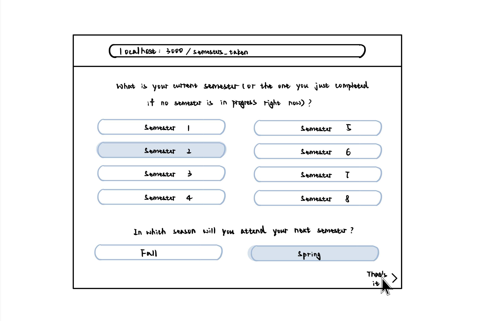
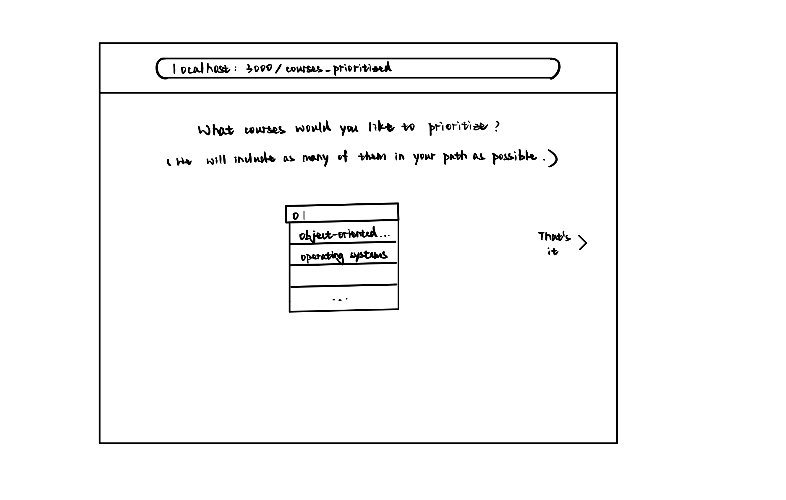
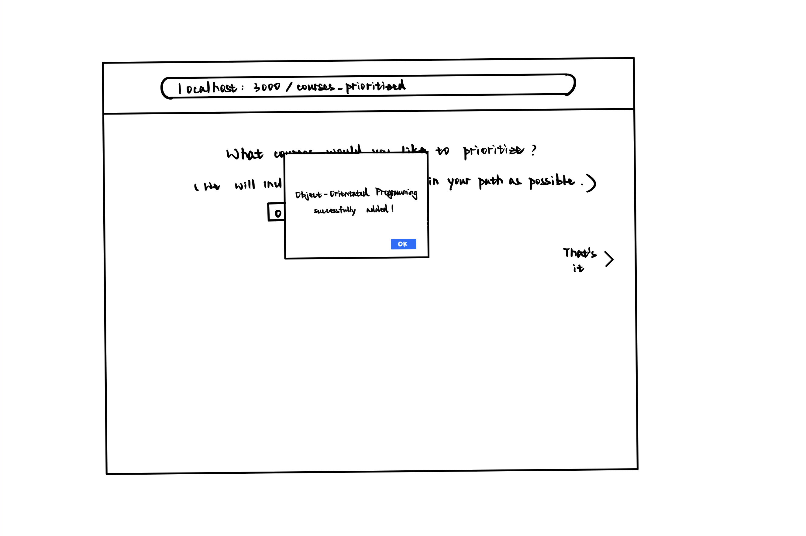
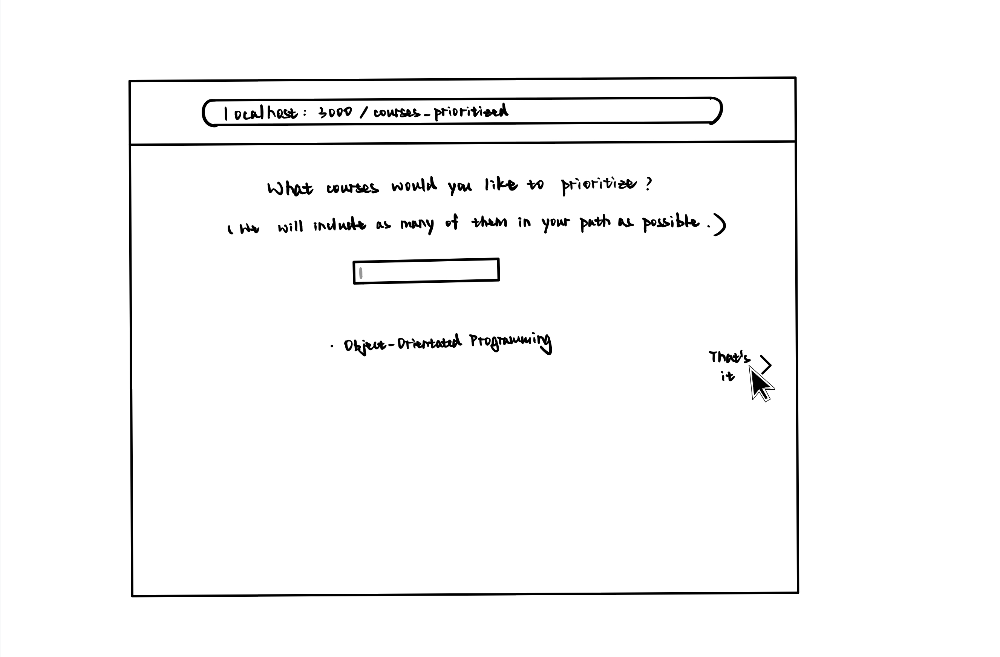
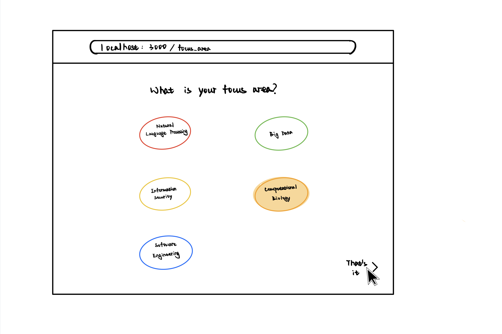
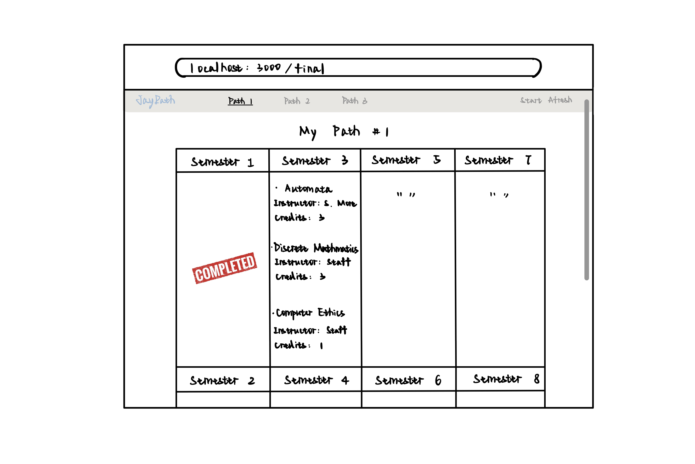
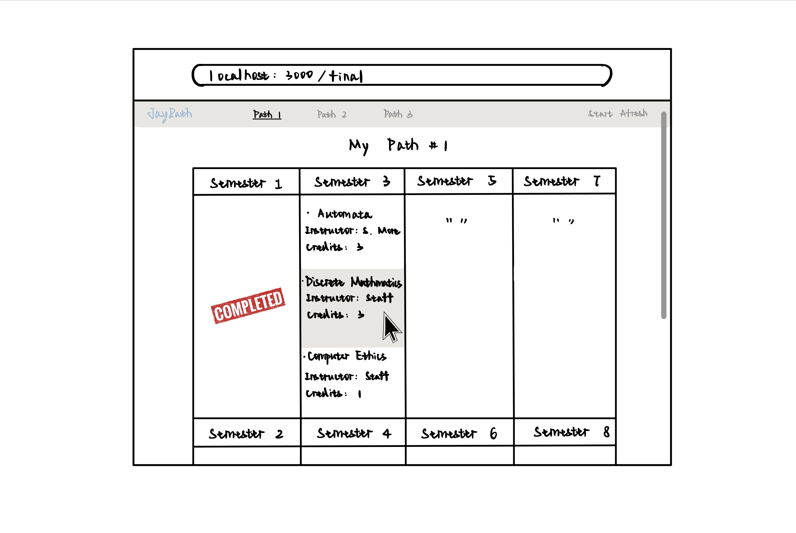

# OO Design

# Wireframe
The first and second page will remain the same as Iteration 2, where the user is first asked to input the courses he/she has taken.

Once all courses are added, the user clicks on "That's it", which would then redirect him/her to the following pages.

The user clicks on one of the focus areas and is then taken to the final recommendation page. The recommendation page shows a complete 4-year schedule with specific courses to take each semester.

User is given more details on a course once his/her cursor hovers on that course. In the event that there does NOT exist a schedule to allow the user to graduate in 4 years, the user is taken to the following page. 

## Iteration Backlog
- As a student , I want to see multiple recommended schedules so that I can choose one based on my personal preferences. 
- As a student, I want my schedule to contain more courses from my focus area so that I take the most value out of my time in college. 
- As a student, I want to view the application on different devices with the same level of comfort. 
- As a student, I would like to see the focus areas each of my recommended class belongs to, so that I get a better idea of what I will learn. 
- NICE TO HAVE: as a student, I want to input my preferred courses so that my schedule can fit my preferences better. 

## Tasks
- Front-end works towards responsive design. 
- Front-end adds in an additional question page and a divider section to navigate to different recommended schedules. 
- Back-end algorithm uses a weighting scheme to limit the computational complexity.

## Retrospective
(On iteration 5)
We encountered multiple strange issues when attempting to deploy our React front-end to Heroku. On one person's machine, the React folder could not be pushed to the Heroku master branch, on another person's machine the deployment was successful yet Heroku reported an application failure. We spent a decent amount of time and it seemed that the issue was caused by an unsupported React Library. There seemed to be no work-around for to avoid usage of that library, so we went ahead and deployed our front-end application on AWS Amplify. 

With network delay (after back-end deployment) and an enhanced back-end algorithm, we realized that the user may not be able to view the schedule recommendations right away. Hence we had to put in an additional loading feature. In general, deployment process involved many issues we failed to foresee, so it seems to be a good idea to deploy ealier on our next project. 

(Overall retrospective)
Looking back at our initial design, our project idea changed a lot along the way. There were questions that were necessary to add in and features that couldn't be realized due to the sheer amount of work required from databases.  
In particular, looking back at our first original project proposal, we finished all of our MUST-HAVE and some of our NICE-TO-HAVE. However, there still exists some NICE-TO-HAVE that we have no time to implement. Like the authetication and admin feature. But those are not very important to our project and we think we did a good job overall.
If we can do it again, we think we will plan better in each iteration and deploy our application earlier.